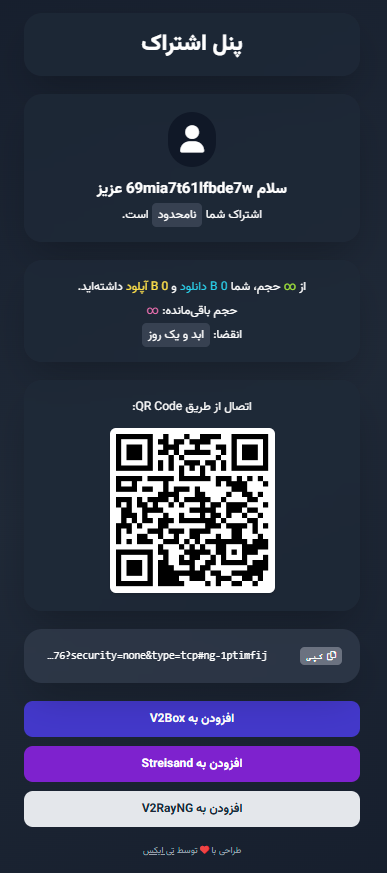

# Ay-X-UI-Theme

Ay-X-UI-Theme Subscription Page Templates Designed By Ay Technic.

## Quick Install

you can install pre-designed user themes as your sub custom ui using below command in terminal:
```bash
bash <(curl -Ls https://raw.githubusercontent.com/shammay-PC/Ay-X-UI-Theme/master/install.sh)
```

## Usable Variables

| Variable       | Description                                    |
| -------------- | ---------------------------------------------- |
| `result`       | Returns the URI for Vmess/Vless.               |
| `total`        | Returns the formatted total traffic.           |
| `expire`       | End date as a timestamp.                       |
| `upload`       | Returns the formatted uploaded traffic.        |
| `download`     | Returns the formatted downloaded traffic.      |
| `totalByte`    | Returns the total traffic in bytes.            |
| `uploadByte`   | Returns the total uploaded traffic in bytes.   |
| `downloadByte` | Returns the total downloaded traffic in bytes. |
| `sId`          | Returns the subscription user ID.              |
| `subUrl`       | Gets the full subscription URL.                |
| `jsonUrl`      | Gets the current subscription json URL         |

**example**
```html
<div>sub url is : {{ .subUrl }}</div>
```

## Steps to Implement

1. Design an HTML page and name it **sub.html**.  
2. Move the file to the following directory:  
   ```
   /etc/x-ui/html/
   ```
3. Go to the panel settings, navigate to the **Subscription** section, and enable the **Custom Template** option.  
4. Save the changes and restart the service.  

If everything is done correctly, your custom template should now be displayed instead of the default subscription page.

## ScreenShots
<details>
<summary>AyVPN</summary>


</details>
<details>
<summary>AIO UI</summary>


</details>
<details>
<summary>Black Eyes</summary>


</details>
<details>
<summary>Fly Theme</summary>


</details>
<details>
<summary>TX v2</summary>


</details>
<details>
<summary>Vislo</summary>


</details>
<details>
<summary>BestBlack</summary>


</details>